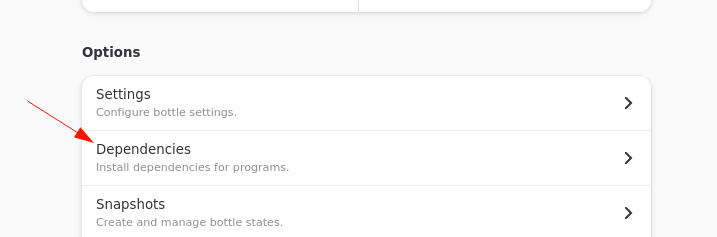
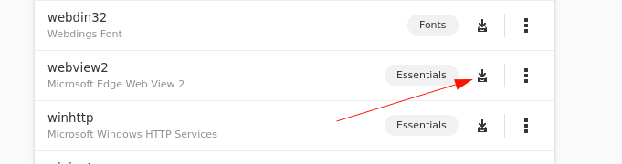
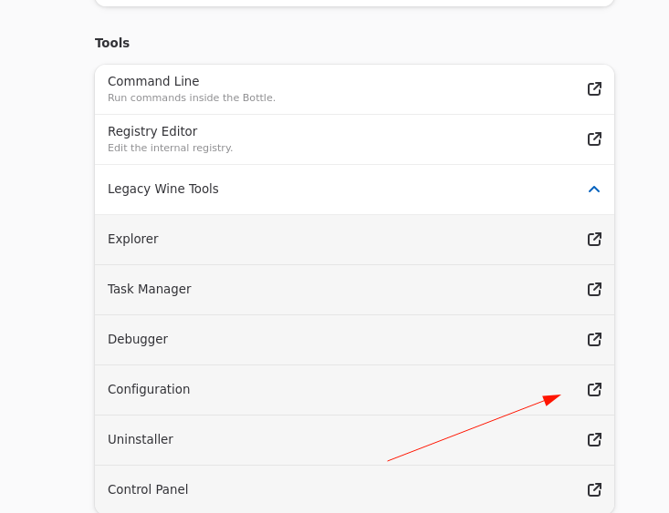
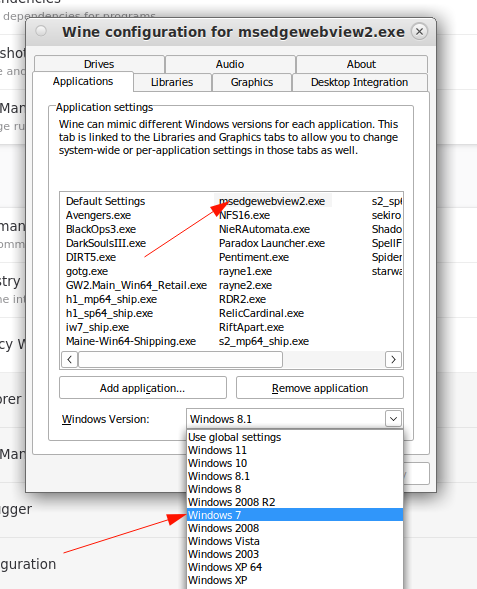
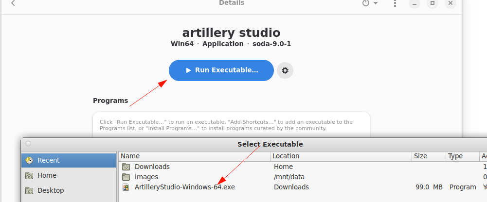
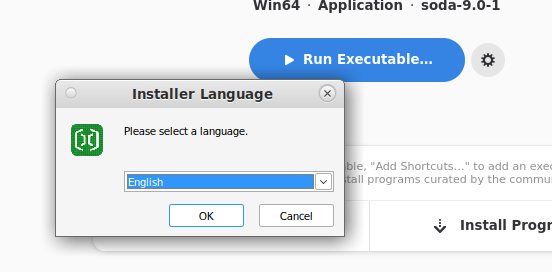

# artillerystudioforlinux
since artillery did not yet bother shipping their slicer for linux or providing some profiles for orca,
we still need to get it running to actually use their new line of printers.

## download the slicer
there is is: https://studio.ota.artillery3d.com/studio/download/windows/latest

## install emulator
with a package manager of your choice install "bottles" ( https://usebottles.com/ ).
you can also use plain "wine", but bottles sits on top of it and i way more userfriendly.
```
sudo dnf install bottles
```

## installing studio in a bottle
### create a bottle


### install dependecies
we need to install webview2



### configure backwards compatibility



### install artillery studio


